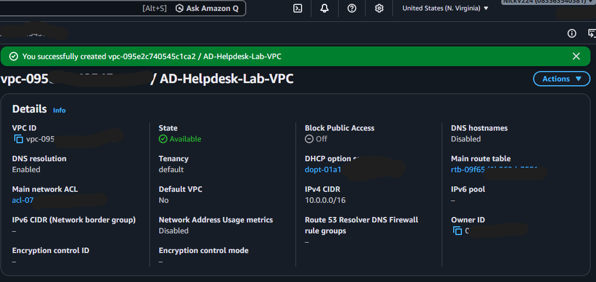
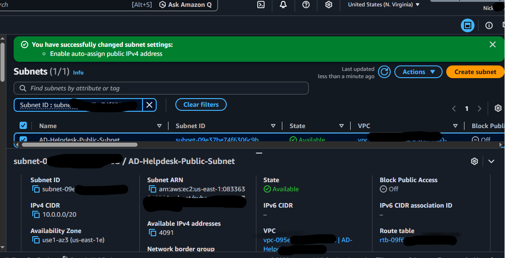
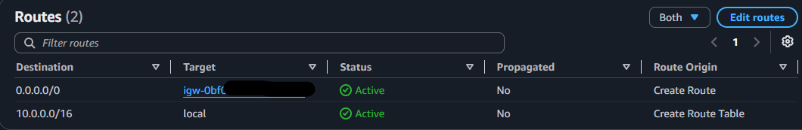

# AWS Networking

This section covers the AWS network I built for the lab before deploying the Windows machines.

## What I Built

- VPC: `AD-Helpdesk-Lab-VPC` — `10.0.0.0/16`
- Public subnet: `AD-Helpdesk-Public-Subnet` — `10.0.0.0/20`
- Internet Gateway: `AD-Helpdesk-IGW`
- Route table: `AD-Helpdesk-Public-RT`
- Default route: `0.0.0.0/0` → Internet Gateway

## Evidence

These screenshots show the network configuration I completed in AWS. I removed or covered sensitive information before adding them to this public repository.

### VPC

The VPC is the main network boundary for the lab and uses the `10.0.0.0/16` address space.

### Subnet

The public subnet uses `10.0.0.0/20` and is associated with the lab VPC.

### Route Table

The route table contains the local VPC route and the default route to the Internet Gateway.

